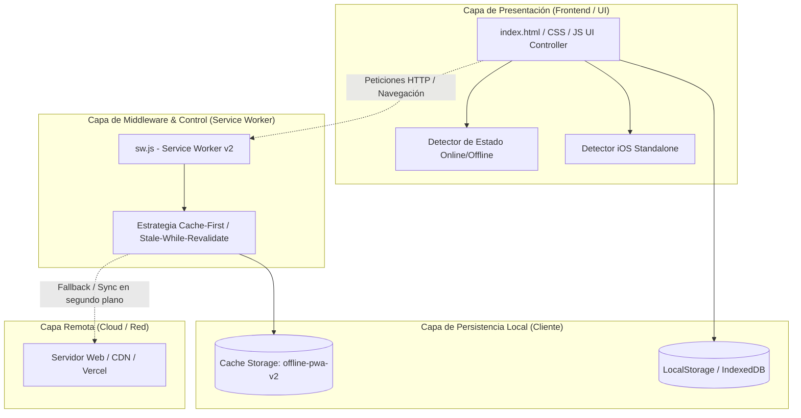

# 🏛️ Arquitectura del Sistema - TamalitosAPP PWA

## 1. Visión General
**TamalitosAPP** está diseñada bajo el patrón de arquitectura **Offline-First App Shell**. Este enfoque garantiza que la interfaz de usuario y los recursos estáticos fundamentales se carguen inmediatamente desde la memoria caché del dispositivo (gestionada por el Service Worker), permitiendo que la aplicación sea plenamente funcional en modo autónomo (*Standalone*) en iOS Safari, incluso sin conectividad a Internet.

---

## 2. Diagrama de Capas de Arquitectura

---

## 3. Componentes Principales

### 3.1. App Shell (`Codigo/index.html`)
- **Responsabilidad:** Proporcionar la estructura visual inicial, los estilos adaptados para pantallas retina/OLED de iPhone y los controladores de eventos.
- **Optimizaciones para iOS:**
  - `viewport-fit=cover`: Habilita la utilización del área completa de la pantalla respetando los *Safe Area Insets* (`env(safe-area-inset-top)`, `env(safe-area-inset-bottom)`).
  - `apple-mobile-web-app-capable`: Notifica al motor WebKit que el sitio puede lanzarse sin los marcos ni la barra de URL de Safari.
  - `apple-mobile-web-app-status-bar-style: black-translucent`: Fusiona la barra de estado superior (batería, reloj, Dynamic Island) con el fondo de la app.

### 3.2. Service Worker (`Codigo/sw.js`)
- **Versión de Caché:** `offline-pwa-v2`
- **Ciclo de Vida:**
  1. `install`: Descarga y almacena en caché atómica los recursos de la App Shell (`index.html`, `manifest.json`, iconos PNG/SVG). Ejecuta `self.skipWaiting()` para no quedar en cola.
  2. `activate`: Recorre los nombres de caché en `caches.keys()`, elimina cualquier caché con versión diferente a la actual (`v1` previa) y toma el control de los clientes activos con `self.clients.claim()`.
  3. `fetch`: 
     - **Peticiones de Navegación (`mode: 'navigate'`):** Busca en caché la URL solicitada; si no la encuentra o si no hay red, sirve de inmediato el `./index.html` precacheado.
     - **Recursos Estáticos:** Devuelve primero la copia en caché y lanza una petición en segundo plano para actualizar el contenido si hay red disponible (*Stale-While-Revalidate*).

### 3.3. Web App Manifest (`Codigo/manifest.json`)
- Define los metadatos de instalación: nombre de la aplicación, tema (`#0f172a`), modo de visualización (`standalone`) y la matriz de iconos con sus respectivas dimensiones y propósitos (`any`, `maskable`).

### 3.4. Capa de Persistencia Local
- **Cache API:** Almacena los ficheros estáticos (HTML, JS, CSS, PNG, SVG).
- **LocalStorage:** Almacena la información transaccional y datos del negocio generados por el usuario de manera síncrona y resistente a recargas o cierres de la app.

---

## 4. Particularidades y Compatibilidad con iOS / WebKit
1. **Obligatoriedad de PNG para `apple-touch-icon`:** WebKit no soporta iconos SVG para la pantalla de inicio; requiere iconos PNG opacos (180x180 px recomendado).
2. **Aislamiento de Almacenamiento en iOS:** La instancia de la PWA instalada en la pantalla de inicio (*Standalone*) corre en un proceso WebKit separado de Safari navegador. Por ende, los datos y el Service Worker deben operar de forma autosuficiente.
3. **Requisito HTTPS:** WebKit bloquea el registro de Service Workers si el origen no es `https://` o `localhost`.
