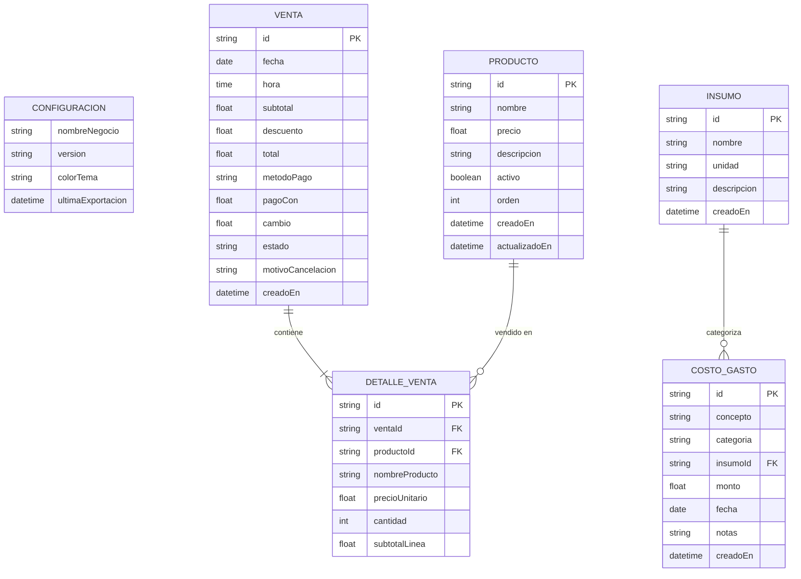
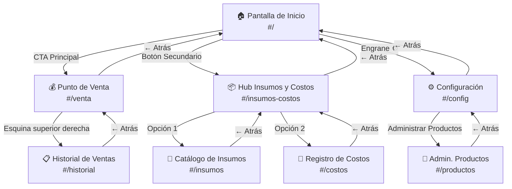

# FASE 2: Arquitectura del Software y Modelo de Datos

---

## 1. Patrón de Arquitectura Frontend

### 1.1 Decisión: SPA Vanilla con Módulos ES6 (Sin Framework)

**Justificación:**
- Cero dependencias = cero riesgo de breaking changes de npm ni bundlers.
- El Service Worker puede precachear la app completa sin build step.
- Reducción de tamaño total de la app a < 200 KB (excluyendo iconos).
- Compatibilidad directa con iOS Safari sin polyfills ni transpilación.

**Patrón adoptado: Component-Based SPA con Hash Router**

```text
┌─────────────────────────────────────────────────────┐
│                    index.html                       │
│  (Shell único, viewport iOS, meta tags, CSS vars)   │
├─────────────────────────────────────────────────────┤
│                   <div id="app">                    │
│         ┌─────────────────────────────┐             │
│         │       Router (Hash)         │             │
│         │  #/ → Home                  │             │
│         │  #/venta → POS              │             │
│         │  #/historial → Historial    │             │
│         │  #/insumos-costos → Hub     │             │
│         │  #/insumos → Catálogo       │             │
│         │  #/costos → Registro        │             │
│         │  #/config → Configuración   │             │
│         │  #/productos → CRUD Prod.   │             │
│         └─────────────────────────────┘             │
├─────────────────────────────────────────────────────┤
│              Capa de Estado (Store)                  │
│    Estado reactivo en memoria con suscripción        │
│    de componentes mediante patrón Observer           │
├─────────────────────────────────────────────────────┤
│           Capa de Persistencia (DB)                 │
│     Wrapper IndexedDB con API async/await            │
│     Transacciones atómicas por Object Store          │
└─────────────────────────────────────────────────────┘
```

### 1.2 Estructura de Archivos del Código

```text
Codigo/
├── index.html              # Shell HTML único (nunca se recarga)
├── manifest.json            # Web App Manifest
├── sw.js                    # Service Worker v3 (precacheo dinámico)
├── icons/                   # Iconos PNG + SVG
├── css/
│   ├── variables.css        # Design tokens (colores, espaciados, radios)
│   ├── base.css             # Reset, tipografía, Safe Area, scroll
│   ├── components.css       # Cards, botones, badges, inputs, modales
│   └── views.css            # Estilos específicos por pantalla
├── js/
│   ├── app.js               # Bootstrap: inicializa router, store, DB
│   ├── router.js            # Hash router con transiciones
│   ├── store.js             # Estado reactivo global (Observer pattern)
│   ├── db.js                # Wrapper IndexedDB (async/await)
│   ├── export.js            # Generación CSV y Web Share API
│   ├── gestures.js          # Swipe-to-delete y touch handlers
│   ├── views/
│   │   ├── home.js          # Pantalla de Inicio
│   │   ├── pos.js           # Terminal Punto de Venta
│   │   ├── historial.js     # Historial de Ventas
│   │   ├── insumos-hub.js   # Hub Insumos y Costos
│   │   ├── insumos.js       # Catálogo de Insumos
│   │   ├── costos.js        # Registro de Costos/Gastos
│   │   ├── config.js        # Configuración General
│   │   └── productos.js     # Administración de Productos
│   └── components/
│       ├── header.js        # Barra superior con navegación
│       ├── modal.js         # Modal reutilizable (confirmaciones)
│       ├── toast.js         # Notificaciones efímeras
│       ├── swipe-item.js    # Componente de lista con swipe
│       └── date-filter.js   # Selector de fecha para filtros
└── generate-icons.js        # Script de generación de iconos
```

### 1.3 Hash Router — Comportamiento

```javascript
// router.js — Esquema simplificado
const ROUTES = {
  '':              () => import('./views/home.js'),
  'venta':         () => import('./views/pos.js'),
  'historial':     () => import('./views/historial.js'),
  'insumos-costos':() => import('./views/insumos-hub.js'),
  'insumos':       () => import('./views/insumos.js'),
  'costos':        () => import('./views/costos.js'),
  'config':        () => import('./views/config.js'),
  'productos':     () => import('./views/productos.js'),
};
```

**¿Por qué Hash Router y no History API?**
- En PWA Standalone de iOS, `history.pushState` puede provocar comportamientos inesperados al recargar (WebKit no siempre intercepta correctamente las URLs virtuales sin servidor).
- El hash (`#/venta`) es siempre local; el Service Worker no necesita manejar rutas artificiales.
- Simplicidad: el `hashchange` event es soportado universalmente y no requiere configuración de servidor.

### 1.4 Patrón de Estado Reactivo (Store)

```javascript
// store.js — Estado global observable
class Store {
  constructor(initialState) {
    this._state = { ...initialState };
    this._listeners = new Map();
  }

  getState() {
    return { ...this._state };
  }

  setState(patch) {
    const prev = { ...this._state };
    Object.assign(this._state, patch);
    // Notificar solo los listeners de las claves que cambiaron
    for (const key of Object.keys(patch)) {
      if (this._listeners.has(key)) {
        this._listeners.get(key).forEach(fn => fn(this._state[key], prev[key]));
      }
    }
  }

  subscribe(key, fn) {
    if (!this._listeners.has(key)) this._listeners.set(key, new Set());
    this._listeners.get(key).add(fn);
    return () => this._listeners.get(key).delete(fn); // Unsubscribe
  }
}

// Estado inicial de la aplicación
export const store = new Store({
  config: null,         // { nombreNegocio, version }
  productos: [],        // Lista de productos activos
  pedidoActual: [],     // Items en la comanda POS en curso
  vistaActual: '',      // Ruta activa del router
});
```

---

## 2. Estrategia de Persistencia Offline

### 2.1 ¿Por qué IndexedDB y no localStorage?

| Criterio | localStorage | IndexedDB |
|---|---|---|
| Capacidad | ~5-10 MB | ~1 GB en iOS |
| Estructura | Key-Value plano (strings) | Object Stores con índices |
| Consultas | Solo `getItem(key)` | Queries por índice, rangos, cursores |
| Rendimiento con muchos registros | Se degrada (parse JSON de toda la tabla) | Acceso O(1) por clave, O(log n) por índice |
| Transacciones | No soporta | ACID por Object Store |
| Tipo de dato | Solo strings (JSON.stringify) | Objetos JS nativos, Blobs, ArrayBuffers |
| Requerimiento de TamalitosAPP | ❌ Insuficiente para historial de ventas con 36K+ registros/año | ✅ Diseñado para este volumen |

**Decisión:** IndexedDB como almacenamiento primario para todas las entidades transaccionales (ventas, costos, insumos, productos). `localStorage` se reserva únicamente para la configuración ligera del negocio y preferencias de UI.

### 2.2 Wrapper IndexedDB — API Diseño

```javascript
// db.js — Interfaz pública del wrapper
class TamalitosDB {
  static DB_NAME = 'TamalitosAPP';
  static DB_VERSION = 1;

  // Conexión lazy singleton
  async getDB() { /* ... */ }

  // CRUD genérico
  async getAll(storeName, indexName?, range?)
  async getById(storeName, id)
  async put(storeName, record)       // Upsert (insert or update)
  async delete(storeName, id)
  async count(storeName)

  // Consultas especializadas
  async getVentasPorFecha(fechaInicio, fechaFin)
  async getCostosPorFecha(fechaInicio, fechaFin)
  async getProductosActivos()
  async getResumenDiario(fecha)      // { totalVentas, totalGastos, utilidad }
}
```

### 2.3 Esquema de Object Stores e Índices

```javascript
// Definición de la base de datos en el evento onupgradeneeded
function crearEsquema(db) {
  // 1. Productos
  const productos = db.createObjectStore('productos', { keyPath: 'id' });
  productos.createIndex('activo', 'activo', { unique: false });
  productos.createIndex('nombre', 'nombre', { unique: false });

  // 2. Insumos
  const insumos = db.createObjectStore('insumos', { keyPath: 'id' });
  insumos.createIndex('nombre', 'nombre', { unique: false });

  // 3. Costos y Gastos
  const costos = db.createObjectStore('costos', { keyPath: 'id' });
  costos.createIndex('fecha', 'fecha', { unique: false });
  costos.createIndex('categoria', 'categoria', { unique: false });

  // 4. Ventas (cabecera)
  const ventas = db.createObjectStore('ventas', { keyPath: 'id' });
  ventas.createIndex('fecha', 'fecha', { unique: false });
  ventas.createIndex('estado', 'estado', { unique: false });

  // 5. Detalle de Venta (líneas del pedido)
  const detalles = db.createObjectStore('detalleVenta', { keyPath: 'id' });
  detalles.createIndex('ventaId', 'ventaId', { unique: false });
  detalles.createIndex('productoId', 'productoId', { unique: false });
}
```

---

## 3. Modelo de Datos — Definición de Entidades

### 3.1 `Configuracion` (localStorage)

```json
{
  "nombreNegocio": "Tamales Doña Mary",
  "version": "1.0.0",
  "colorTema": "#0f172a",
  "ultimaExportacion": "2026-09-22T17:30:00.000Z"
}
```

| Campo | Tipo | Requerido | Descripción |
|---|---|---|---|
| `nombreNegocio` | `string` | Sí | Nombre visible del establecimiento |
| `version` | `string` | Auto | Versión semántica de la app |
| `colorTema` | `string` | No | Color principal del tema (hex) |
| `ultimaExportacion` | `ISO 8601` | Auto | Timestamp del último respaldo |

---

### 3.2 `Producto`

```json
{
  "id": "prod_1695412800000",
  "nombre": "Tamal Verde",
  "precio": 25.00,
  "descripcion": "Tamal de salsa verde con pollo",
  "activo": true,
  "orden": 1,
  "creadoEn": "2026-09-22T10:00:00.000Z",
  "actualizadoEn": "2026-09-22T10:00:00.000Z"
}
```

| Campo | Tipo | Requerido | Descripción |
|---|---|---|---|
| `id` | `string` | Auto | Prefijo `prod_` + timestamp de creación |
| `nombre` | `string` | Sí | Nombre del producto terminado |
| `precio` | `number` | Sí | Precio de venta unitario (> 0) |
| `descripcion` | `string` | No | Descripción breve |
| `activo` | `boolean` | Sí | `false` = oculto del POS (soft-delete) |
| `orden` | `number` | Auto | Posición en la grilla del POS |
| `creadoEn` | `ISO 8601` | Auto | Fecha de creación |
| `actualizadoEn` | `ISO 8601` | Auto | Última modificación |

---

### 3.3 `Insumo`

```json
{
  "id": "ins_1695412800001",
  "nombre": "Masa para tamales",
  "unidad": "kg",
  "descripcion": "Masa de maíz nixtamalizado",
  "creadoEn": "2026-09-22T10:00:00.000Z"
}
```

| Campo | Tipo | Requerido | Descripción |
|---|---|---|---|
| `id` | `string` | Auto | Prefijo `ins_` + timestamp |
| `nombre` | `string` | Sí | Nombre del insumo |
| `unidad` | `string` | No | Unidad de medida libre (kg, pza, lt) |
| `descripcion` | `string` | No | Detalle adicional |
| `creadoEn` | `ISO 8601` | Auto | Fecha de alta |

---

### 3.4 `CostoGasto`

```json
{
  "id": "costo_1695412800002",
  "concepto": "Compra de masa",
  "categoria": "insumo",
  "insumoId": "ins_1695412800001",
  "monto": 350.00,
  "fecha": "2026-09-22",
  "notas": "15 kg en Molino Don Pancho",
  "creadoEn": "2026-09-22T11:00:00.000Z"
}
```

| Campo | Tipo | Requerido | Descripción |
|---|---|---|---|
| `id` | `string` | Auto | Prefijo `costo_` + timestamp |
| `concepto` | `string` | Sí | Descripción del gasto |
| `categoria` | `string` | Sí | Enum: `insumo`, `servicio`, `otro` |
| `insumoId` | `string\|null` | No | FK a `Insumo.id` si `categoria === 'insumo'` |
| `monto` | `number` | Sí | Monto del gasto (> 0) |
| `fecha` | `YYYY-MM-DD` | Sí | Fecha del egreso |
| `notas` | `string` | No | Observaciones adicionales |
| `creadoEn` | `ISO 8601` | Auto | Timestamp de registro |

---

### 3.5 `Venta` (cabecera)

```json
{
  "id": "venta_1695412800003",
  "fecha": "2026-09-22",
  "hora": "17:35:22",
  "subtotal": 95.00,
  "descuento": 5.00,
  "total": 90.00,
  "metodoPago": "efectivo",
  "pagoCon": 100.00,
  "cambio": 10.00,
  "estado": "cobrada",
  "motivoCancelacion": null,
  "creadoEn": "2026-09-22T17:35:22.000Z"
}
```

| Campo | Tipo | Requerido | Descripción |
|---|---|---|---|
| `id` | `string` | Auto | Prefijo `venta_` + timestamp |
| `fecha` | `YYYY-MM-DD` | Auto | Fecha de la transacción |
| `hora` | `HH:mm:ss` | Auto | Hora de la transacción |
| `subtotal` | `number` | Auto | Suma de (precio × cantidad) de todos los items |
| `descuento` | `number` | No | Descuento global en pesos (default 0) |
| `total` | `number` | Auto | `subtotal - descuento` |
| `metodoPago` | `string` | Sí | Enum: `efectivo`, `transferencia` |
| `pagoCon` | `number\|null` | No | Monto con el que pagó el cliente |
| `cambio` | `number\|null` | Auto | `pagoCon - total` (si aplica) |
| `estado` | `string` | Auto | Enum: `cobrada`, `cancelada` |
| `motivoCancelacion` | `string\|null` | Cond. | Texto libre si `estado === 'cancelada'` |
| `creadoEn` | `ISO 8601` | Auto | Timestamp preciso |

---

### 3.6 `DetalleVenta` (líneas del pedido)

```json
{
  "id": "det_1695412800004",
  "ventaId": "venta_1695412800003",
  "productoId": "prod_1695412800000",
  "nombreProducto": "Tamal Verde",
  "precioUnitario": 25.00,
  "cantidad": 3,
  "subtotalLinea": 75.00
}
```

| Campo | Tipo | Requerido | Descripción |
|---|---|---|---|
| `id` | `string` | Auto | Prefijo `det_` + timestamp + index |
| `ventaId` | `string` | Sí | FK a `Venta.id` |
| `productoId` | `string` | Sí | FK a `Producto.id` |
| `nombreProducto` | `string` | Sí | Snapshot del nombre al momento de la venta |
| `precioUnitario` | `number` | Sí | Snapshot del precio al momento de la venta |
| `cantidad` | `number` | Sí | Cantidad vendida (entero > 0) |
| `subtotalLinea` | `number` | Auto | `precioUnitario × cantidad` |

> **Nota sobre snapshots:** Se almacena `nombreProducto` y `precioUnitario` como copia al momento de la venta, no como referencia dinámica. Esto garantiza que si el dueño cambia el precio de un producto después, el historial de ventas anteriores refleja el precio que realmente se cobró.

---

### 3.7 Diagrama Entidad-Relación



---

## 4. Ergonomía Táctil y CSS Design System para iOS

### 4.1 Design Tokens (Variables CSS)

```css
:root {
  /* Paleta principal */
  --color-bg:           #0f172a;
  --color-surface:      #1e293b;
  --color-surface-alt:  #334155;
  --color-border:       #475569;
  --color-text:         #f8fafc;
  --color-text-muted:   #94a3b8;
  --color-primary:      #38bdf8;
  --color-primary-dark: #0284c7;
  --color-success:      #10b981;
  --color-danger:       #ef4444;
  --color-warning:      #f59e0b;
  --color-accent:       #a78bfa;

  /* Tipografía */
  --font-family: -apple-system, BlinkMacSystemFont, "SF Pro Display",
                 "Segoe UI", Roboto, Helvetica, Arial, sans-serif;
  --font-mono: ui-monospace, SFMono-Regular, Menlo, Monaco, monospace;
  --font-size-xs:   0.75rem;   /* 12px */
  --font-size-sm:   0.875rem;  /* 14px */
  --font-size-base: 1rem;      /* 16px — mínimo para evitar zoom en iOS inputs */
  --font-size-lg:   1.125rem;  /* 18px */
  --font-size-xl:   1.5rem;    /* 24px */
  --font-size-2xl:  2rem;      /* 32px */

  /* Espaciado */
  --space-xs: 4px;
  --space-sm: 8px;
  --space-md: 16px;
  --space-lg: 24px;
  --space-xl: 32px;

  /* Radios de borde */
  --radius-sm: 8px;
  --radius-md: 12px;
  --radius-lg: 18px;
  --radius-full: 9999px;

  /* Touch targets — mínimo Apple HIG: 44x44pt, recomendado: 48x48px */
  --touch-target-min: 48px;

  /* Transiciones */
  --transition-fast: 150ms ease;
  --transition-normal: 250ms ease;

  /* Safe Areas */
  --safe-top: env(safe-area-inset-top, 0px);
  --safe-bottom: env(safe-area-inset-bottom, 0px);
  --safe-left: env(safe-area-inset-left, 0px);
  --safe-right: env(safe-area-inset-right, 0px);
}
```

### 4.2 Reglas Base para iOS Standalone

```css
/* Prevenir zoom no deseado en inputs (iOS hace zoom si font < 16px) */
input, select, textarea {
  font-size: var(--font-size-base); /* 16px mínimo */
}

/* Prevenir pull-to-refresh accidental en iOS Standalone */
html {
  overscroll-behavior-y: contain;
}

/* Prevenir selección de texto accidental al tocar rápido */
button, .btn, .touch-target {
  -webkit-user-select: none;
  user-select: none;
  -webkit-touch-callout: none;
}

/* Feedback táctil visual */
.btn:active, .touch-target:active {
  transform: scale(0.96);
  opacity: 0.85;
  transition: transform 80ms ease, opacity 80ms ease;
}

/* Tamaño mínimo de zona táctil */
.btn, .touch-target {
  min-height: var(--touch-target-min);
  min-width: var(--touch-target-min);
  display: inline-flex;
  align-items: center;
  justify-content: center;
}

/* Layout principal con Safe Areas */
body {
  padding-top: max(var(--space-md), var(--safe-top));
  padding-bottom: max(var(--space-lg), var(--safe-bottom));
  padding-left: max(var(--space-md), var(--safe-left));
  padding-right: max(var(--space-md), var(--safe-right));
}

/* Prevenir bounce/elastic scroll en el body */
body {
  position: fixed;
  width: 100%;
  height: 100%;
  overflow: hidden;
}

/* El contenedor scrolleable es interno, no el body */
#app {
  width: 100%;
  height: 100%;
  overflow-y: auto;
  -webkit-overflow-scrolling: touch;
}
```

### 4.3 Componente Swipe-to-Delete (Especificación CSS + JS)

```text
Estado reposo:
┌──────────────────────────────────┐
│  🫔 Masa para tamales      kg   │
└──────────────────────────────────┘

Swipe izquierda (translateX: -80px):
┌──────────────────────────────────┬──────────┐
│  🫔 Masa para tamales      kg   │ 🗑 Borrar │ ← fondo rojo
└──────────────────────────────────┴──────────┘

Swipe completo (translateX: -100%):
→ Elemento se desliza fuera + animación de colapso + confirmación modal
```

**Umbrales de gesto para iOS:**
- Inicio de detección: `deltaX > 10px && Math.abs(deltaX) > Math.abs(deltaY)` (evitar interferencia con scroll vertical).
- Revelación del botón: `translateX: max(-80px, deltaX)`.
- Auto-complete al soltar: si `deltaX < -40%` del ancho, animar hasta `-100%` y ejecutar borrado.
- Cancelar: si `deltaX > -40%`, animar de regreso a `0`.

### 4.4 Mapa de Navegación Visual



