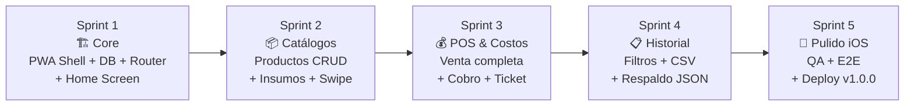

# FASE 4: Plan de Trabajo y Desglose de Tareas (WBS)

Cada sprint está estimado a **1 semana** de trabajo (considerando un desarrollador frontend dedicado). Las tareas están ordenadas por dependencia técnica. Cada tarea incluye su historia de usuario relacionada (HU-XXX).

---

## Sprint 1: Core — PWA Shell, Base de Datos y Navegación
**Objetivo:** Tener la infraestructura técnica funcionando: Service Worker, IndexedDB wrapper, router hash, store reactivo y la estructura base de CSS.

**Épica:** EP-01 (Infraestructura PWA), EP-02 (Home)

| # | Tarea | HU | Detalles Técnicos |
|---|---|---|---|
| 1.1 | Crear estructura de carpetas `css/` y `js/` en `Codigo/` | — | Mover CSS inline de `index.html` a archivos separados. Crear `variables.css`, `base.css`, `components.css`, `views.css` |
| 1.2 | Implementar `js/db.js` — Wrapper IndexedDB | HU-002 | Clase `TamalitosDB` con métodos `getAll`, `getById`, `put`, `delete`, `count`. Crear los 5 Object Stores con índices según esquema de Fase 2 |
| 1.3 | Implementar `js/store.js` — Estado reactivo | HU-003 | Clase `Store` con `getState()`, `setState(patch)`, `subscribe(key, fn)`. Estado inicial: `config`, `productos`, `pedidoActual`, `vistaActual` |
| 1.4 | Implementar `js/router.js` — Hash Router | HU-003 | Escuchar `hashchange`. Mapa de rutas a funciones `render()`. Transición CSS entre vistas (fade 200ms). Manejo de ruta default `#/` |
| 1.5 | Implementar `js/app.js` — Bootstrap | HU-001 | Punto de entrada: inicializar DB, cargar config, registrar SW, montar router. `DOMContentLoaded` → `App.init()` |
| 1.6 | Actualizar `index.html` como Shell SPA | HU-001 | Reemplazar el contenido del MVP por el contenedor `
`. Vincular CSS y JS con módulos ES6 (`type="module"`) |
| 1.7 | Implementar `js/views/home.js` | HU-010 | Renderizar: logo, versión, botón ⚙️, botón "Registrar Venta", botón "Insumos y Costos" |
| 1.8 | Actualizar `sw.js` (v3) | HU-002 | Agregar las nuevas rutas CSS y JS al arreglo `ASSETS_TO_CACHE`. Incrementar versión de caché |
| 1.9 | Implementar CSS Design System base | HU-001 | `variables.css`: tokens completos. `base.css`: reset, safe-area, overscroll-behavior, body fixed + `#app` scroll. `components.css`: `.btn`, `.card`, `.input`, `.badge` |
| 1.10 | Prueba de integración: instalar en iPhone | HU-001 | Desplegar en Vercel. Verificar instalación standalone. Verificar carga offline. Verificar navegación hash sin recarga |

**Criterio de salida del Sprint 1:**
- La app se instala en un iPhone y se abre en modo Standalone.
- La navegación entre Home y las rutas vacías funciona sin recargar la página.
- IndexedDB se inicializa correctamente (verificar en Safari Inspector).
- El Service Worker cachea todos los archivos nuevos.

---

## Sprint 2: Catálogos — Productos e Insumos
**Objetivo:** CRUD completo de Productos y Catálogo de Insumos con swipe-to-delete funcional en iOS.

**Épicas:** EP-03 (Configuración/Productos), EP-04 (Insumos)

| # | Tarea | HU | Detalles Técnicos |
|---|---|---|---|
| 2.1 | Implementar `js/views/config.js` | HU-020 | Formulario: nombre del negocio, sección con enlaces a "Administrar Productos", "Exportar", "Respaldo". Guardar config en `localStorage` |
| 2.2 | Implementar `js/views/productos.js` | HU-021, HU-022, HU-023 | Lista de productos con badge de estado (activo/inactivo). Botón "Agregar Producto" → formulario modal. Tap en producto → formulario de edición. Swipe left → botón "Desactivar" |
| 2.3 | Implementar `js/components/modal.js` | HU-021 | Modal genérico reutilizable: título, contenido HTML, botones "Cancelar" / "Confirmar". Animación de entrada/salida. Backdrop con tap-to-close |
| 2.4 | Implementar `js/gestures.js` — Swipe handler | HU-031 | Detectar `touchstart`, `touchmove`, `touchend`. Calcular deltaX/deltaY. Prevenir scroll vertical si swipe horizontal. Umbrales: reveal a -80px, auto-complete a -40%. Animación CSS con `transform: translateX()` |
| 2.5 | Implementar `js/components/swipe-item.js` | HU-031 | Componente de lista que envuelve un item con el handler de swipe. Renderiza el botón de acción oculto (rojo "Eliminar" o "Desactivar") detrás del item |
| 2.6 | Implementar `js/views/insumos-hub.js` | — | Vista intermedia con 2 botones grandes: "Inventario de Insumos" y "Registrar Costos". Botón "← Atrás" a Home |
| 2.7 | Implementar `js/views/insumos.js` | HU-030, HU-031 | Lista de insumos con swipe-to-delete. Formulario de alta: nombre, unidad (texto libre), descripción. Validación: nombre obligatorio |
| 2.8 | Implementar `js/components/toast.js` | — | Notificación efímera (toast/snackbar): aparece abajo, dura 3s, auto-dismiss. Estilos: éxito (verde), error (rojo), info (azul) |
| 2.9 | Implementar `js/components/header.js` | HU-003 | Barra superior reutilizable: título de la sección, botón "← Atrás" (navega a ruta padre), slot derecho para acciones (ej. botón historial en POS) |
| 2.10 | Prueba de integración en iPhone | HU-023, HU-031 | Verificar swipe-to-delete en iOS Safari. Verificar que no interfiere con scroll vertical. Verificar creación/edición/desactivación de productos. Verificar persistencia de datos tras cerrar app |

**Criterio de salida del Sprint 2:**
- Puedo crear, editar y desactivar productos desde la pantalla de Admin.
- Puedo agregar y eliminar insumos con gesto swipe.
- Los modales de confirmación funcionan correctamente en iOS.
- Los datos persisten tras cerrar y reabrir la app.

---

## Sprint 3: POS y Registro de Costos
**Objetivo:** Flujo completo de venta (agregar productos → cobrar → guardar) y registro de costos/gastos.

**Épicas:** EP-05 (POS), EP-04 (Costos)

| # | Tarea | HU | Detalles Técnicos |
|---|---|---|---|
| 3.1 | Implementar `js/views/pos.js` — Grilla de productos | HU-040 | Query `getProductosActivos()` de IndexedDB. Render de grilla CSS Grid responsive (2 columnas en iPhone, 3 en iPad). Cada botón muestra nombre + precio |
| 3.2 | Implementar lógica de comanda (pedido actual) | HU-041 | Manejo en `store.pedidoActual[]`. Al presionar botón: si ya existe → incrementar `cantidad`; si no → agregar con cantidad=1. Botones `+`/`−` por línea. Auto-remove cuando cantidad=0 |
| 3.3 | Implementar lista del pedido en curso | HU-041 | Renderizado reactivo (suscrito a `store.pedidoActual`). Cada línea: nombre, cantidad, subtotal, botones `+`/`−`. Total general al final. Scroll interno si hay muchos items |
| 3.4 | Implementar modal de cobro | HU-042, HU-043 | Modal con: resumen del pedido, total, selector de método de pago, campo "Pagó con", cálculo de cambio en tiempo real, campo de descuento, botón "Confirmar Cobro". Validación: si pagó con < total → deshabilitar confirmación |
| 3.5 | Implementar guardado de venta en IndexedDB | HU-042 | Transacción atómica: crear `Venta` + crear N registros `DetalleVenta`. Snapshot de nombre y precio del producto. Limpiar `store.pedidoActual`. Mostrar toast de confirmación |
| 3.6 | Implementar ticket digital y Web Share | HU-044 | Generar texto plano formateado. Usar `navigator.share({ text })`. Fallback: copiar al clipboard con `navigator.clipboard.writeText()` |
| 3.7 | Implementar `js/views/costos.js` | HU-032 | Formulario: concepto (texto libre o selector de insumos), categoría (Insumo/Servicio/Otro), monto, fecha (default hoy), notas. Lista cronológica de gastos del mes debajo del formulario |
| 3.8 | Prueba de flujo completo de venta | HU-042 | Crear productos → ir al POS → armar pedido → cobrar → verificar en historial. Todo offline |

**Criterio de salida del Sprint 3:**
- Puedo completar una venta de principio a fin desde el POS.
- El cálculo de cambio funciona correctamente.
- Los costos se registran y se muestran en orden cronológico.
- Todo funciona offline sin errores.

---

## Sprint 4: Historial, Filtros y Exportación
**Objetivo:** Consulta de historial con filtros por fecha, resumen diario, cancelación de ventas, exportación CSV y respaldo JSON.

**Épicas:** EP-06 (Historial), EP-07 (Respaldo), EP-03 (Exportar)

| # | Tarea | HU | Detalles Técnicos |
|---|---|---|---|
| 4.1 | Implementar `js/views/historial.js` — Lista de ventas | HU-050 | Query `getVentasPorFecha(hoy)`. Render de lista con hora, total, # productos, estado. Ventas canceladas con badge rojo |
| 4.2 | Implementar `js/components/date-filter.js` | HU-051 | Input `type="date"` nativo (bien soportado en iOS Safari). Default: hoy. Al cambiar fecha, re-query y re-render de la lista |
| 4.3 | Implementar resumen diario en cabecera | HU-050 | Componente `<ResumenDia>`: total ventas (cobradas), total gastos, utilidad bruta. Colores: verde si utilidad > 0, rojo si < 0 |
| 4.4 | Implementar vista de detalle de venta | HU-052 | Al tocar una venta, expandir/colapsar (accordion) o abrir modal con: desglose de `DetalleVenta` (nombre, cantidad, subtotal), descuento, total, método de pago |
| 4.5 | Implementar cancelación de venta | HU-053 | Botón "Cancelar" visible solo si la venta tiene < 24h. Modal con campo de texto obligatorio para motivo. `update` en IndexedDB: `estado='cancelada'`, `motivoCancelacion=texto` |
| 4.6 | Implementar `js/export.js` — Generación CSV | HU-024 | Funciones `generarCSVVentas(fechaInicio, fechaFin)` y `generarCSVGastos(fechaInicio, fechaFin)`. Encoding UTF-8 con BOM para compatibilidad con Excel |
| 4.7 | Implementar compartir archivo via Web Share API | HU-024 | `new File([blob], nombre, { type: 'text/csv' })` → `navigator.share({ files: [file] })`. Fallback: `window.open(dataURI)` si `canShare` retorna false |
| 4.8 | Implementar respaldo completo JSON | HU-060 | `exportarRespaldo()`: leer todas las tablas de IndexedDB, serializar como JSON, compartir como archivo `.json` |
| 4.9 | Implementar importación de respaldo | HU-061 | `importarRespaldo(file)`: parsear JSON, validar estructura, mostrar resumen, solicitar confirmación, limpiar stores, insertar datos. Input `type="file"` con `accept=".json"` |
| 4.10 | Prueba de exportación en iPhone | HU-024 | Verificar que Web Share API abre correctamente en iOS Standalone. Verificar que el CSV se puede abrir en Numbers/Excel. Verificar que el respaldo JSON se puede restaurar en otro dispositivo |

**Criterio de salida del Sprint 4:**
- El historial muestra ventas con filtro por fecha y resumen diario.
- Se pueden cancelar ventas recientes con motivo registrado.
- La exportación CSV funciona en iOS vía Web Share.
- El respaldo completo se genera y se puede restaurar exitosamente.

---

## Sprint 5: Pulido iOS, QA y Lanzamiento
**Objetivo:** Ajustes finos de experiencia en iOS, pruebas exhaustivas offline, corrección de edge cases y preparación para producción.

**Épicas:** Transversales a todas

| # | Tarea | HU | Detalles Técnicos |
|---|---|---|---|
| 5.1 | Auditoría de Safe Area Insets en todos los modelos de iPhone | HU-001 | Probar en iPhone SE (sin notch), iPhone 14 (Dynamic Island), iPad. Ajustar paddings y posición de botones flotantes |
| 5.2 | Auditoría de gestos táctiles | HU-031 | Verificar que swipe-to-delete no interfiere con swipe-back de iOS (navegación del sistema). Verificar que pull-to-refresh está deshabilitado en Standalone |
| 5.3 | Optimizar rendimiento de listas largas | HU-050 | Si el historial supera 100 items visibles, implementar scroll virtual o paginación "cargar más" para mantener 60fps en iPhone |
| 5.4 | Prevenir zoom no deseado en inputs | HU-001 | Verificar que todos los inputs tienen `font-size ≥ 16px`. Verificar `maximum-scale=1` en viewport (solo si no causa problemas de accesibilidad) |
| 5.5 | Validar persistencia tras purga WebKit | HU-002 | Simular: no abrir la app durante 7 días → verificar si IndexedDB sigue intacto (en PWA instalada debería persistir). Documentar comportamiento |
| 5.6 | Prueba completa del flujo de negocio (E2E manual) | Todas | Escenario completo: configurar negocio → crear productos → crear insumos → registrar gastos → vender productos → cobrar → ver historial → exportar CSV → generar respaldo → restaurar en otro dispositivo |
| 5.7 | Actualizar `ASSETS_TO_CACHE` en SW (v3) | HU-002 | Listar TODOS los archivos CSS y JS finales. Verificar que el precacheo incluye el árbol completo. Implementar versionado dinámico si es necesario |
| 5.8 | Actualizar README.md y documentación | — | Reflejar la arquitectura final, instrucciones de despliegue y uso |
| 5.9 | Desplegar versión 1.0.0 en Vercel | — | Merge a `main`, verificar deploy automático, probar en iPhone con URL de producción |
| 5.10 | Verificación de Lighthouse PWA | HU-001 | Ejecutar auditoría Lighthouse en Chrome DevTools. Target: PWA score 100, Performance > 90 |

**Criterio de salida del Sprint 5:**
- La app funciona de forma impecable en iPhone SE, iPhone 14+, y iPad.
- Todos los gestos táctiles son fluidos y no generan conflictos con iOS.
- El ciclo completo de negocio (configurar → vender → consultar → exportar) se completa sin errores.
- La app pasa la auditoría Lighthouse PWA al 100%.

---

## Resumen de Entregables por Sprint

---

## Matriz de Trazabilidad: Historias ↔ Sprints

| Historia | Sprint 1 | Sprint 2 | Sprint 3 | Sprint 4 | Sprint 5 |
|---|:---:|:---:|:---:|:---:|:---:|
| HU-001: Instalación iOS | ✅ | | | | 🔍 |
| HU-002: Offline | ✅ | | | | 🔍 |
| HU-003: Navegación SPA | ✅ | | | | |
| HU-010: Dashboard Home | ✅ | | | | |
| HU-020: Nombre Negocio | | ✅ | | | |
| HU-021: Agregar Producto | | ✅ | | | |
| HU-022: Editar Producto | | ✅ | | | |
| HU-023: Desactivar Producto | | ✅ | | | |
| HU-024: Exportar CSV | | | | ✅ | |
| HU-030: Agregar Insumo | | ✅ | | | |
| HU-031: Swipe Delete | | ✅ | | | 🔍 |
| HU-032: Registrar Costo | | | ✅ | | |
| HU-040: Grilla POS | | | ✅ | | |
| HU-041: Agregar a Comanda | | | ✅ | | |
| HU-042: Cobrar Venta | | | ✅ | | |
| HU-043: Cálculo Cambio | | | ✅ | | |
| HU-044: Ticket Digital | | | ✅ | | |
| HU-050: Ventas del Día | | | | ✅ | |
| HU-051: Filtrar por Fecha | | | | ✅ | |
| HU-052: Detalle de Venta | | | | ✅ | |
| HU-053: Cancelar Venta | | | | ✅ | |
| HU-060: Respaldo JSON | | | | ✅ | |
| HU-061: Importar Respaldo | | | | ✅ | |

✅ = Implementación principal | 🔍 = Verificación / Ajustes de QA

