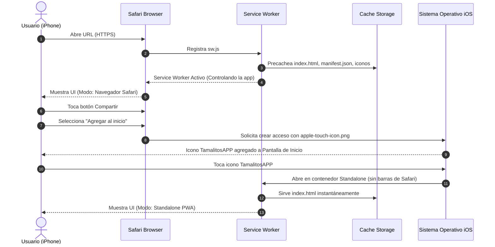
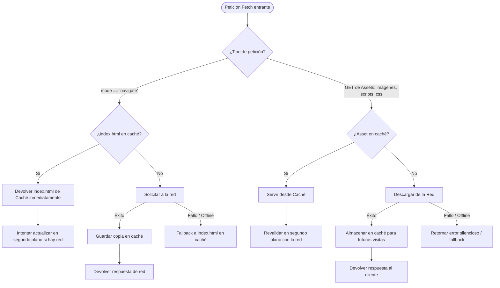

# 🔄 Diagramas y Flujos de TamalitosAPP

Este documento describe los tres flujos operacionales esenciales de la aplicación: el proceso de instalación en iOS, el ciclo de vida del Service Worker ante peticiones de red y la experiencia de usuario en modo offline.

---

## 1. Flujo de Instalación en iOS Safari ("Agregar al Inicio")



---

## 2. Flujo de Intercepción de Peticiones y Caché (Service Worker)



---

## 3. Flujo de Usuario y Persistencia Offline

```mermaid
flowchart LR
    A[Usuario abre la App] --> B{¿Hay conexión a internet?}
    
    B -->|Sí (Online)| C[Badge verde ONLINE]
    B -->|No (Offline / Modo Avión)| D[Badge rojo OFFLINE]
    
    C --> E[Usuario introduce datos de ventas/pedidos]
    D --> E
    
    E --> F[Presiona Guardar]
    F --> G[(LocalStorage del Dispositivo)]
    G --> H[Confirmación visual inmediata en pantalla]
    
    H --> I[Cerrar app / Reiniciar dispositivo]
    I --> J[Reabrir TamalitosAPP sin conexión]
    J --> K[Presiona Leer]
    K --> L[Datos recuperados intactos desde LocalStorage]
```
